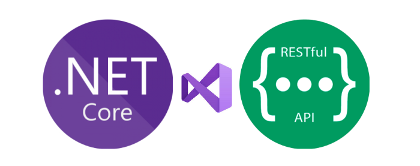
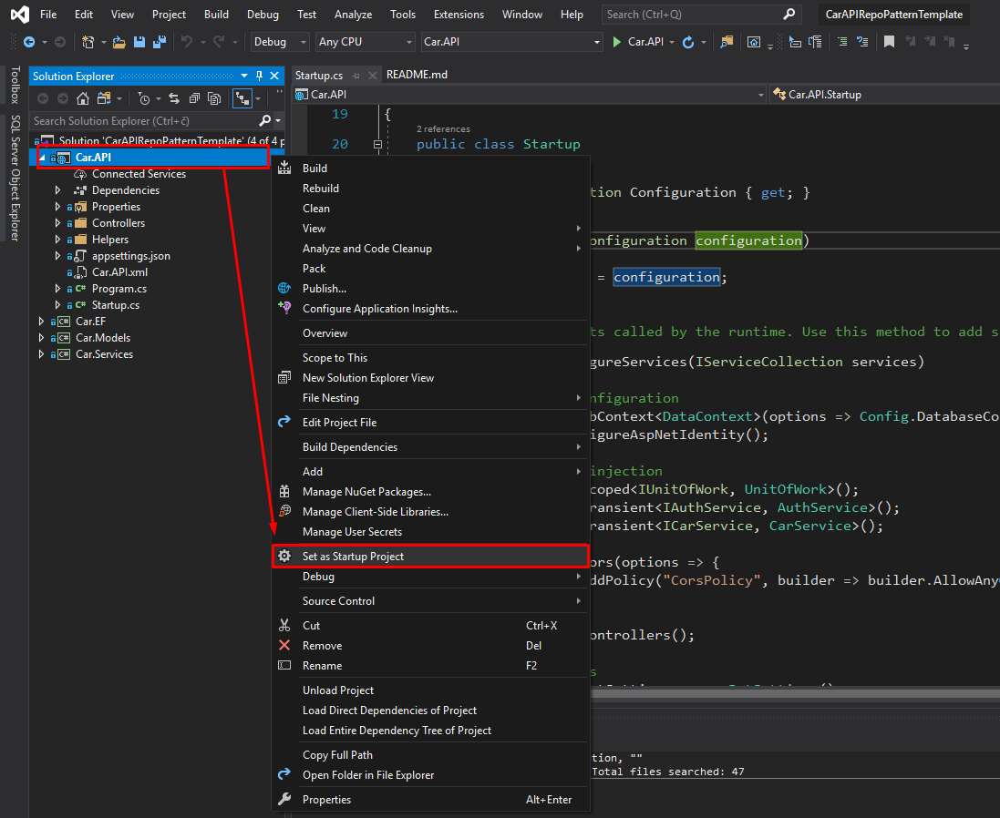
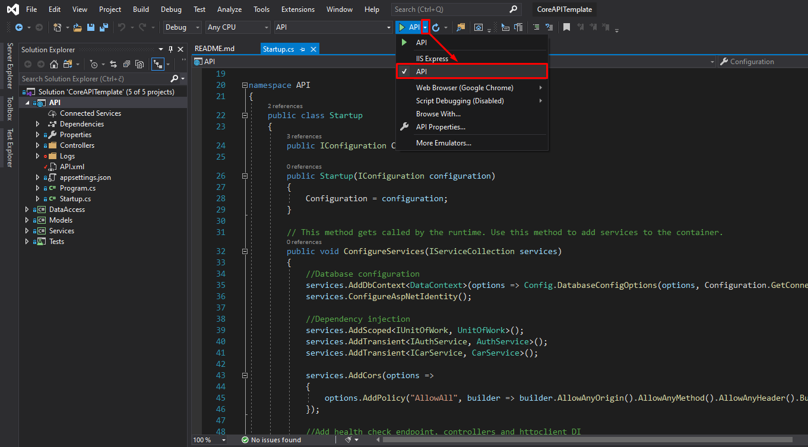
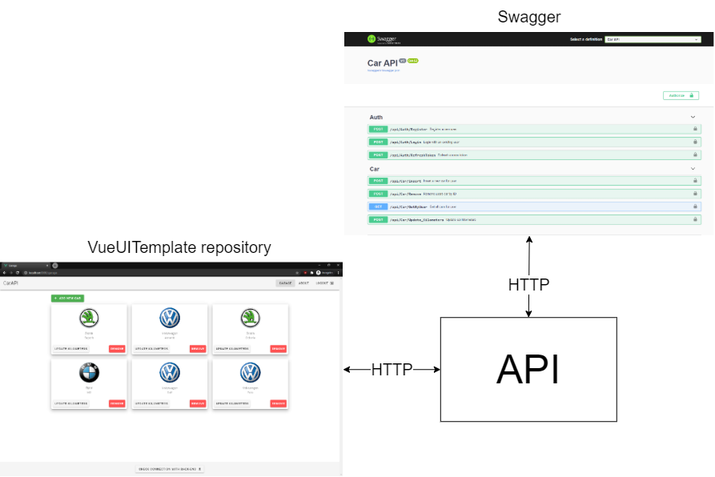
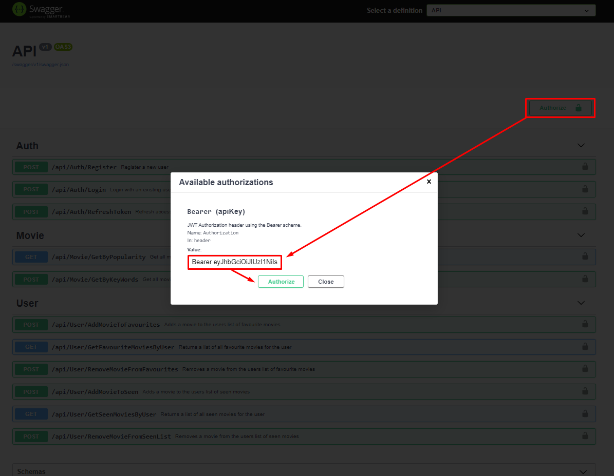
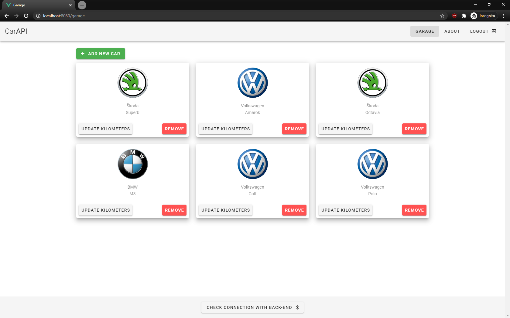

<h1 align="center">
  </a>
</h1>


<h2 align="center">.NET Core API Reference Implementation</h2>

<p align="center">
  <a href="#about">About</a> ◈
  <a href="#architecture">Architecture</a> ◈
  <a href="#prerequisites">Prerequisites</a> ◈
  <a href="#build-and-run">Build and run</a> ◈
  <a href="#how-to-test">How to test</a> ◈
  <a href="#changelog">Changelog</a>
</p>

## About

An API built on .Net Core 3.1 implementing [Repository &amp; UnitOfWork patterns](https://docs.microsoft.com/en-us/aspnet/mvc/overview/older-versions/getting-started-with-ef-5-using-mvc-4/implementing-the-repository-and-unit-of-work-patterns-in-an-asp-net-mvc-application).
It includes authentication via [JWT tokens](https://jwt.io/) to access specific resources
aswell as [MSSQL](https://en.wikipedia.org/wiki/Microsoft_SQL_Server) for data storage 
with [EntityFramework Core](https://docs.microsoft.com/en-us/ef/core/) as the chosen
ORM. It also includes [Moq](https://github.com/moq/moq4) to enable near 100% unit test coverage, 
[Serilog](https://github.com/serilog/serilog) for event logging 
and [AutoMapper](https://docs.automapper.org/en/stable/Getting-started.html#what-is-automapper) for object mapping.

**The main purpose of the project is to be used as a reference implementation in
case of need.**

## Architecture

The entire API is composed of multiple layers with the architecture 
that can be seen on the below image.


Highest layer (API) consists of controllers whose job is to authenticate users,
receive HTTP request and give responses. This layer forwards the requests data
to the service layer via DI. Service layer contains all the business logic 
and its main job is processing data. Furthermore, service layer uses 
UnitOfWork interface obtained through the DI to communicate with the data access layer.
Data access layers role is to communicate with the database.

The biggest benefit of such architecture
is that the service layer is completely decoupled from the data access layer.
Since data access layer is abstracted away from the business logic, we're enabled
to change the underlying ORM or swap out the entire data access layer with
minimal changes. Moreover, such architecture enables us to properly test
our software with unit and integration tests with numerous frameworks and tools
to achieve as safe and bug-free code as possible.

## Prerequisites
You will need the following tools:

* [SQL Server Express LocalDB](https://docs.microsoft.com/en-us/sql/database-engine/configure-windows/sql-server-express-localdb?view=sql-server-ver15)
* [Visual Studio 2019](https://visualstudio.microsoft.com/vs/community/) (version 16.6 or later)
* [.NET Core SDK 3.1](https://dotnet.microsoft.com/download/dotnet-core/3.1)

## Build and run

You can either run the application through CLI or straight from Visual Studio.

#### Run from CLI

  1. Create a folder on local computer to clone the repo, something like `C:\source` will be fine.

  2. Open cmd within newly created folder and clone the [CoreAPITemplate repo from Github](https://github.com/PatriQ94/CoreAPITemplate.git) 
     ```console
      git clone https://github.com/PatriQ94/CoreAPITemplate.git 
     ```

  3. Run the application
     ```console
       dotnet run --project ./CoreAPITemplate/API/API.csproj
     ```

  4. Launch [https://localhost:5001](https://localhost:5001) in your browser to view the API

#### Run from Visual Studio

  1. Create a folder on local computer to clone the repo, something like `C:\source` will be fine.

  2. Open cmd within newly created folder and clone the [CoreAPITemplate repo from Github](https://github.com/PatriQ94/CarAPITemplate) 
     ```console
      git clone https://github.com/PatriQ94/CoreAPITemplate.git
     ```

  3. Navigate to ``CoreAPITemplate`` folder and 
open ``CoreAPITemplate.sln`` with Visual Studio.

  4. Once the solution is opened, right click the ``API`` project and
select ``Set as Startup Project`` if it's not selected already.



  5. The last step is to select ``API`` from the dropdown on top of your screen
and press the green triangle to run it.



  6. Launch [https://localhost:5001](https://localhost:5001) in your browser to view the API
   
## How to test

There is a plethora of ways to test this project and all its functionalities. 
The two primary ways are through the built-in [Swagger UI](https://swagger.io/tools/swagger-ui/) 
or through my front-end [VueJS application.](https://github.com/PatriQ94/VueUITemplate)




#### Test with Swagger UI
Swagger UI is an already built-in tool that helps you visualize and interact
with the API making it very easy to see what the API has to offer. Once you have started the program
you can visit [https://localhost:5001](https://localhost:5001) in order to see 
all the endpoints that API offers.


It is important to notice that all ``Car`` endpoints require you to be authorized
in order to access their functionalities. To do so, you need to either register or login. 
Once that is done, you will receive two JWT tokens: an access token and a refresh
token. Afterwards, you press the green ``Authorize`` button on the right side, enter 
your access token with format ``"Bearer <your_token>"`` and click ``Authorize`` like
shown on the image below.



This will grant you access to Car endpoints until your access token has expired. 
Then, you will have use the ``/api/Auth/RefreshToken`` endpoint, to gain a newly
generated access and refresh tokens.

#### Test with the VueJS application

If you would prefer to test this back-end API with a nicer and better looking front-end
application to simulate a real world scenario feel free to check 
out [my other project aswell.](https://github.com/PatriQ94/VueUITemplate)
Below image shows an example of the UI from the VueUITemplate project.



### Changelog

 Edited |Comment |
------ |------ |
5.6.2020 | Project creation, added swagger, mapped out initial structure |
8.6.2020 | Added database connection and migrations |
9.6.2020 | Improved API documentation on swagger |
11.6.2020 | Added login and register endpoints, code refactoring |
12.6.2020 | Refactored most of the project, changed database entities, added refresh tokens endpoint  
15.6.2020 | Refactoring, code cleanup and improved documentation 
16.6.2020 | Created .Tests project, 100% test coverage of car service
18.6.2020 | Added Serilog for logging
19.6.2020 | Added AutoMapper for object mapping
8.7.2020 and on | Improvements of the documentation
18.7.2020 and on | Restructured the entire repository
